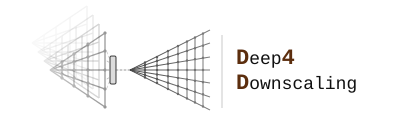

<p align="center">
  <picture>
    <source media="(prefers-color-scheme: dark)" srcset="docs/logo-dark.svg" width="450">
    <source media="(prefers-color-scheme: light)" srcset="docs/logo-light.svg" width="450">
    
  </picture>
</p>

[](https://opensource.org/licenses/MIT)
[](https://doi.org/10.5281/zenodo.19355157)

## Description

`deep4downscaling` is a Python library for developing deep learning models for statistical downscaling. It provides data preprocessing, established architectures (DeepESD, U-Nets, ViT), training and inference utilities, community-standard evaluation metrics, climate change signal analysis, and explainability tools.

**Documentation:** [deep4downscaling.readthedocs.io](https://deep4downscaling.readthedocs.io) (or build locally with `mkdocs serve`)

## Installation

```bash
git clone https://github.com/SantanderMetGroup/deep4downscaling/
cd deep4downscaling
pip install --upgrade pip setuptools wheel
pip install .
```

For development:

```bash
pip install -e ".[docs]"
```

## Quickstart

```python
import deep4downscaling.trans as trans
from deep4downscaling.deep.models import DeepESDtas
from deep4downscaling.deep.loss import MseLoss
from deep4downscaling.deep.train import standard_training_loop

# Preprocess xarray datasets, build a DataLoader, then train
# See docs/getting-started/quickstart.md for the full workflow
```

## Documentation

| Resource | Description |
| --- | --- |
| [Documentation site](https://deep4downscaling.readthedocs.io) | User guide, API reference, how-tos |
| [`notebooks/`](notebooks/) | End-to-end Jupyter tutorial workflows |
| [Contributing](docs/contributing.md) | Branching model and PR guidelines |

Build the docs locally:

```bash
pip install -e ".[docs]"
mkdocs serve
```

## Contributing

Pull requests target the `devel` branch. See [docs/contributing.md](docs/contributing.md) for the full workflow.

| Branch | Purpose |
| --- | --- |
| `main` | Stable, release-ready code |
| `devel` | Active development |

## Citation

If you use this library in your research, please cite it via the [Zenodo DOI](https://doi.org/10.5281/zenodo.19355157).

## License

MIT
