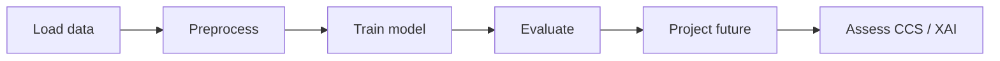

# Workflow

An end-to-end `deep4downscaling` project typically follows six stages. Each stage maps to a module in the library.

## 1. Load data

Import GCM/reanalysis predictors and observational predictands as `xarray.Dataset` objects from NetCDF (or other xarray-compatible sources).

## 2. Preprocess

Use [`deep4downscaling.trans`](../api/trans.md) to:

- Remove incomplete time steps (`remove_days_with_nans`)
- Align temporal coordinates (`align_datasets`)
- Standardize to a reference climatology (`standardize`)
- Split into train/validation/test (`split_data`)
- Convert to numpy for PyTorch (`xarray_to_numpy`)

See [Preprocessing](preprocessing.md) and [Data conventions](../getting-started/data-conventions.md).

## 3. Train

Choose a model from [`deep4downscaling.deep.models`](../api/deep/models.md) and a compatible loss from [`deep4downscaling.deep.loss`](../api/deep/loss.md).

Training loops in [`deep4downscaling.deep.train`](../api/deep/train.md) cover:

| Loop | Use case |
| --- | --- |
| `standard_training_loop` | Supervised deterministic or stochastic models |
| `adversarial_training_loop` | DeepESD with adversarial discriminator |
| `standard_cgan_training_loop` | Pix2Pix-style conditional GAN |

Optional: attach a [`TrainingTracker`](../api/deep/tracker.md) to log and visualize training progress.

## 4. Evaluate (historical period)

Run inference with [`deep4downscaling.deep.pred`](../api/deep/pred.md), then score with [`deep4downscaling.metrics`](../api/metrics.md).

Choose metrics appropriate to your variable:

- **Temperature** — bias, RMSE, correlation, diurnal temperature range
- **Precipitation** — wet-day frequency (R01), SDII, Rx1day, relative biases
- **Probabilistic models** — CRPS, normalized rank

See [Evaluation metrics](metrics.md) for guidance.

## 5. Project future conditions

Apply the trained model to future GCM outputs. Post-process with:

- `trans.undo_standardization` to recover physical units
- `trans.scaling_delta_correction` for bias-aware delta scaling when needed
- `trans.replicate_across_time` to broadcast static fields across time

Write results to NetCDF for downstream climate analysis.

## 6. Assess climate change signals and explainability

- **CCS** — compare historical vs. future projections with [`metrics_ccs`](../api/metrics_ccs.md)
- **XAI** — interpret model behaviour with [`deep4downscaling.deep.xai`](../api/deep/xai.md)

## Mapping notebooks to workflow stages

| Notebook | Stages covered |
| --- | --- |
| `downscaling_deepesd.ipynb` | 1–5 (deterministic) |
| `downscaling_stochastic_deepesd.ipynb` | 1–5 (probabilistic) |
| `downscaling_vit.ipynb` | 1–5 (ViT + CRPS) |
| `downscaling_cgan.ipynb` | 1–5 (adversarial) |
| `cordexbench_downscaling_deepesd.ipynb` | 1–5 (benchmark dataset) |
| `explainability_deepesd.ipynb` | 6 (XAI) |

See the [Tutorials](../tutorials/index.md) page for links.
